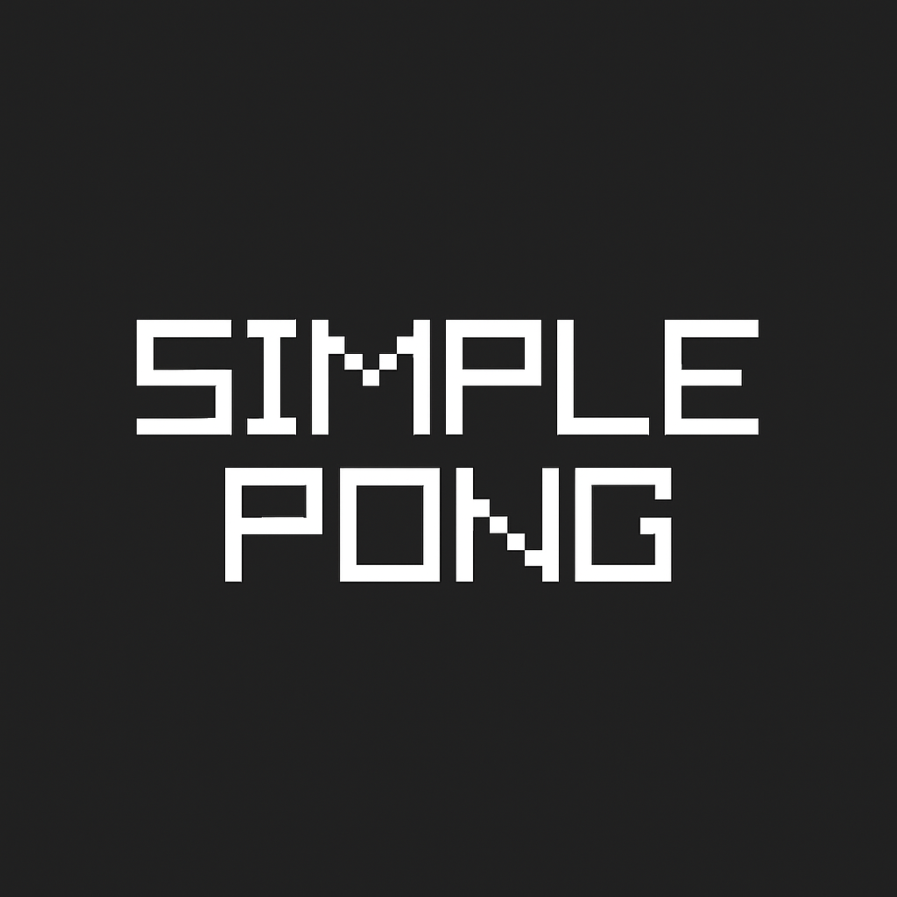

<div align="center">
  
  <h1>Simple Pong</h1>
  <p>A classic Pong game developed in C using the Raylib library, featuring particle systems, sound effects, and interface.</p>

**[🇧🇷 Português](README-pt.md) | [🇺🇸 English](README.md)**
</div>

<br>

---

## Features

- Classic Pong gameplay with responsive controls
- Particle system for visual effects on collisions
- Sound effects for countdown and collisions
- Scoring system with victory screen
- Pause/resume functionality
- Visual countdown before game start
- Debug mode with real-time information

---

## How to Run

### Prerequisites

- CMake (version 3.10 or higher)
- C Compiler (GCC, Clang, or MSVC)
- Raylib (automatically downloaded)

### Compilation

```bash
git clone https://github.com/eduardomcb/simple-pong-raylib.git
cd simple-pong
mkdir build && cd build
cmake ..
make
./simple_pong
```

---

## Controls

| Action | Player 1 | Player 2 |
|--------|----------|----------|
| Move Up | W | ↑ |
| Move Down | S | ↓ |
| Start Game | SPACE | SPACE |
| Pause/Unpause | P | P |
| Restart | R | R |
| Debug Info | D (hold) | D |

---

## Project Structure

```
simple-pong/
├── assets/audio/              # Audio files
├── logo/                      # Project logo
├── src/
│   ├── audio/                 # Audio management
│   ├── game/                  # Main game logic
│   │   ├── ball.c/h
│   │   ├── game.c/h
│   │   ├── paddle.c/h
│   │   └── particles_system.c/h
│   ├── utils/                 # Constants and utilities
│   └── main.c
└── CMakeLists.txt
```

---

## Technologies

- **C** - Programming language
- **Raylib** - Game development framework
- **CMake** - Build system

---

## Customization

Edit `src/utils/constants.h` to modify game settings:

```c
#define SCREEN_WIDTH 1280       // Screen width
#define SCREEN_HEIGHT 800       // Screen height
#define WINNING_SCORE 5         // Score to win
#define BALL_INITIAL_SPEED 5    // Ball initial speed
```